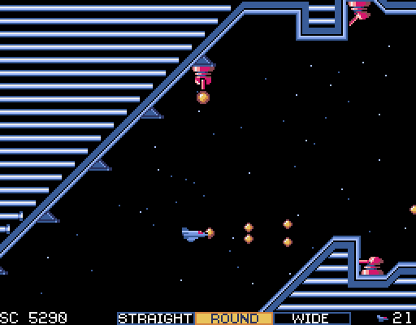
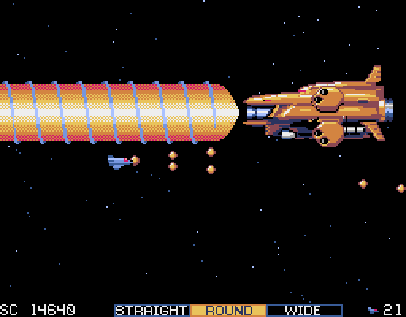

# GRASLAY version 1.10
GRASLAYはレトロ風横スクロールシューティングゲームです。

## 動作環境
Windows 7,8.1,10の64bit専用です。

Pyxelというレトロゲームエンジンで動作しています。Pyxelに関しては以下のサイトをご覧ください。
<https://github.com/kitao/pyxel/blob/master/README.ja.md>

## 実行方法
プログラムは以下にzipがあるのでダウンロードしてください。
zipファイルを解凍後、graslay.exeを実行してください。

ふりーむ！ 
https://www.freem.ne.jp/win/game/25159

プログラムがアンチウィルスソフトに削除される場合があります（pythonでまれにある）。
ダウンロードしても削除されてしまう場合は、除外フォルダを設定しそこにダウンロードするなどの対処をしてください。

## 操作方法
* カーソルキーで自機が移動します。
* Xキーでショット、Zキーで武器チェンジします。
* マウスでも操作可能です。左クリックでショット、右クリックで武器チェンジします。
* ESCキーでポーズ、そこからプログラム終了できます。
* Qキーでいつでもプログラム終了できます。
* PCのゲームコントローラでも操作できます。PS4のコントローラもUSB接続で可能です。
* 難易度はEASYとNORMALがあります。コンティニーでクレジットが無くなってゲームオーバーになるとクレジットが増えるようになります。
* CUSTOMモードで任意の残機、ステージから開始できます、また追加武装も選択できます。ただし、スコアランキングには登録されません。

## ゲームについて

全６ステージ構成です。１ステージは比較的短いです。

1. 敵前線基地
2. 細胞
3. 高速スクロール
4. 神殿
5. 工場
6. 敵本拠地

## 武器について

武器は以下の３種類の組み合わせになります。パワーアップはありません。

* __STRAIGHT__ 直線方向のショットと、上下ボムを発射します。
* __ROUND__ ショットを押し続けると、真後ろから前方まで可変します。また、前方にミサイルを発射します。
* __MULTI__ ８方向のショットと、やや後ろ下にスプレッドボムを発射します。

## 不具合等

バグや感想は以下twitterにいただけるとありがたいです。

https://twitter.com/Ontake441

## 動画配信等について

果たしてやってくれる方がいらっしゃるか謎ですが、ご自由にどうぞ。

## アンインストール

アンインストールは、zipを展開したフォルダを削除してください。
また、ユーザホームディレクトリ（C:\\users\\[ユーザ名]等）に以下ファイルを作成しているので削除してください。

`.graslay`

`.graslay_ranking`

## 使用BGMについて

以下のフリーBGM素材を使わせていただきました。
素晴らしい曲をありがとうございます（順不同）。

shimtone様

https://dova-s.jp/_contents/author/profile295.html

* タイトル idola cell
* ステージ３ Spear
* ステージ５ Abstract
* ステージ６－１ Break the Wedge
* ステージ６－２ Fantasma
* ステージ６－３ In Dark Down
* ボス Grenade
* ランキング with silence

FLASH☆BEAT様

https://dova-s.jp/_contents/author/profile266.html

* ステージ１ Dream Fantasy
* エンディング Fireworks

ISAo様

https://dova-s.jp/_contents/author/profile081.html

* 最終ボス Blaze

魔王魂様

https://maoudamashii.jokersounds.com/music_bgm.html

* ステージ２ ダンジョン２２
* ステージ４ ダンジョン１５
* ステージクリアー ジングル０２
* ゲームオーバー ジングル０７

## ライセンスについて
本ゲームでは以下ソフトウエアを使用しています。

* https://www.python.org/
* https://github.com/kitao/pyxel/blob/master/README.ja.md
* https://www.pygame.org/

## ご注意
お約束ですが、このソフトウェアにはなんの保証もついていません。例えこのソフトウェアを利用したことでなにか問題が発生しても、作者はなんの責任も負いません。

ソース、画像データ等はGitHubに上がっていますが、著作権は作者にありますので、無断でコピー・配布はできません。

## 修正履歴

### 0.91
* テスト版初回公開

### 1.00
* 0.91のEASY,NORMALをNORMAL,HARDに変更し、新たに調整したEASYを追加。
* ステージ２ボスの触手パンチで当たり判定が残るのを修正。

### 1.10
* カスタムモードで追加武装を選択できるようにした。

